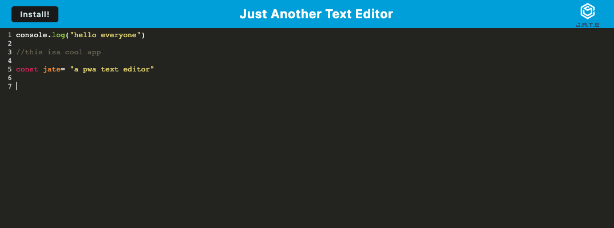

# PWA-Text-Editor


## Description

The purpose of this project was to create to progressive web application text editor.This app uses webPack to bundle the files, workbox to make service workers and webpack-pwa-manifest to make the manifest.json file. This app is installable and can run even when its not connected to internet.

## Table of Contents

- [Description](#Description)
- [Installation](#Installation)
- [Usage](#Usage)
- [Built-With](#Built-With)
- [Contributing-guidelines](#Contributing-guidelines)
- [Author](#Author)
- [Badges](#Badges)
- [License](#License)

## Installation

Here are the dependencies needed to run this app:

```
"devDependencies": {
    "@babel/core": "^7.15.0",
    "@babel/plugin-transform-runtime": "^7.15.0",
    "@babel/preset-env": "^7.15.0",
    "@babel/runtime": "^7.15.3",
    "babel-loader": "^8.2.2",
    "css-loader": "^6.2.0",
    "html-webpack-plugin": "^5.3.2",
    "http-server": "^0.11.1",
    "style-loader": "^3.2.1",
    "webpack": "^5.51.1",
    "webpack-cli": "^4.8.0",
    "webpack-dev-server": "^4.0.0",
    "webpack-pwa-manifest": "^4.3.0",
    "workbox-webpack-plugin": "^6.2.4"
  },
  "dependencies": {
    "code-mirror-themes": "^1.0.0",
    "idb": "^6.1.2"
  }
}

```

## Usage

Just click on the heroku link to open the app or if you want to use this app locally, first go to the to root directory, (in this case text-editor) and run open an integrated terminal and run "npm run start". This will build the bundle and put it in a folder called 'dist'. The app should now be up and running on localhost:3000. You can also install the app onto your computor.



## Built With

- IndexedDB
- 
- 
- 
- 
- 
- 
- workbox-webpack-plugin
- webpack-pwa-manifest

## Contributing Guidlines

If you would like to contribute to this app, please contact me and we can discuss further.

## Author

**Chris Gibson**

- [Link to Chris's Portfolio Site](https://chrischarlesgibson.github.io/Chris-Gibson-project-portfolio/)
- [Link to Chris's Github](https://github.com/chrischarlesgibson)
- [Link to Chris's LinkedIn](https://www.linkedin.com/in/chris-gibson-415909250/)

## Badges


## License

Licensed under the MIT license.[License details here](https://opensource.org/licenses/MIT)
